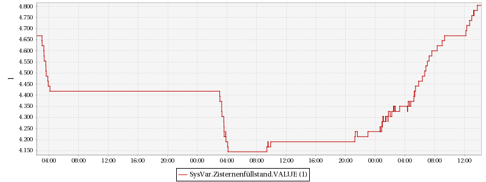
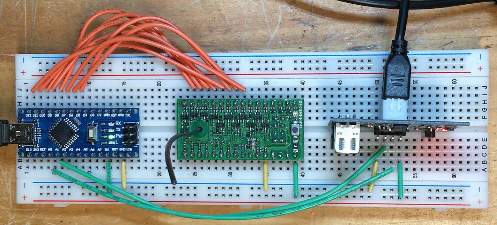
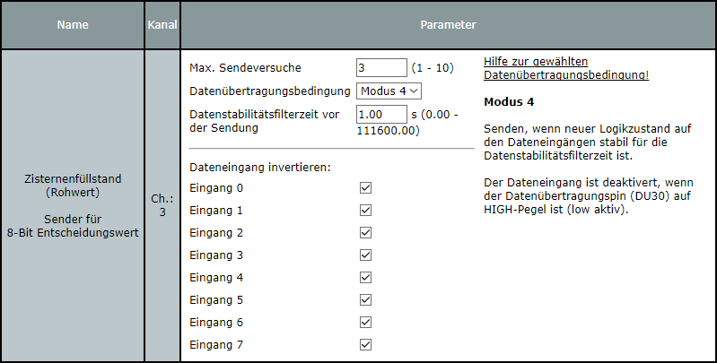

# HomeMatic Ultraschall-Füllstandsmessung

Mit wenigen Modulen kann eine Ultraschall-Füllstandsmessung für das [Hausautomationssystem HomeMatic](http://www.homematic.com/) realisiert werden.

## Details
 
* Eine aufwändige Messwertvorverarbeitung sorgt für einen stabilen Messwert mit einer hohen Genauigkeit.
* Durch die fast vollständige Ausnutzung der 8 Bit des Sendemoduls ergibt sich eine maximale Abweichung von 0,2%. Bei einer 6000l Zisterne bedeutet das eine maximale Abweichung von nur 12l.
* Ein spezieller Fehlerwert (255) kennzeichnet eine fehlerhafte Messung oder einen defekten Sensor.

Anhand des folgenden vergrößerten Ausschnitts einer Trendkurve einer 6000l-Zisterne ist die hohe Stabilität der Messung erkennbar:



## Bauteileliste

* Arduino Nano V3
* HomeMatic 8-bit Sendemodul (HM-MOD-EM-8Bit)
* Ultraschall-Modul mit wasserdichtem Sensor (Liste siehe unten)
* USB-Netzteil inkl. Mini-USB-Kabel

### Mögliche Ultraschall-Module

(Die Angaben sind ungeprüft aus dem Internet zusammengetragen.)

|Typ|Min. Abstand [cm]|Max. Abstand [cm]|Auflösung [mm]|Öffnungswinkel [°]|Bemerkungen|
|:---:|:---:|:---:|:---:|:---:|:---:|
|JSN-SR04T bzw. TE501|25|450|5|<50|Wasserdichter abgesetzter Sensor; im Einsatz beim Autor|
|US-100|2|450|1|<15|angeblich temperaturkompensiert|
|HY-SRF05|2|450|2|<15||
|HC-SR04|2|450|3|<15||

## Verschaltung der Module

Anschluss Ultraschall-Modul:

|JSN-SR04T|Arduino Nano|
|:---:|:---:|
|5V|5V|
|Trig|A0|
|Echo|A1|
|GND|GND|

Anschluss HomeMatic-Sendemodul:

|HM-MOD-EM-8Bit|Arduino Nano|
|:---:|:---:|
|3,5-12V|5V|
|GND|GND|
|INH1|8 (PB0)|
|INH2|9 (PB1)|
|INH3|10 (PB2)|
|INH4|11 (PB3)|
|INH5|12 (PB4)|
|INH6|5 (PD5)|
|INH7|6 (PD6)|
|INH8|7 (PD7)|

Prototypischer Aufbau:



## Montage Ultraschallsensor

Folgendes ist bei der Montage des Ultraschallsensors zu beachten:
* Unbedingt den minimalen Abstand zur Wasseroberfläche für das verwendete Ultraschallmodul beachten (z.B. 25cm für JSN-SR04).
* Vor dem Ultraschallmodul muss der Messkegel frei von Hindernissen sein.
* Die Reflexionsfläche (Wasseroberfläche) muss senkrecht zur Achse des Ultraschallmoduls sein.

## Programmierung Arduino Nano

Der [Sketch levelsensor.ino](levelsensor/levelsensor.ino) ist entsprechend dem Anwendungsfall zu konfgurieren und auf den Arduino Nano zu laden. Dafür wird die [Arduino IDE](https://www.arduino.cc/en/main/software) benötigt.

### Konfiguration

Am Anfang des Sketches befinden sich etliche Konfigurationsoptionen. Folgende Optionen müssen mindestens für die eigene Anwendung angepasst werden:

|Name|Einheit|Bedeutung|
|---|---|---|
|AIR_TEMPERATURE|°C|Lufttemperatur im Tank|
|AIR_HUMIDITY|%|Luftfeuchtigkeit im Tank (Der Effekt ist sehr gering.)|
|DISTANCE_RANGE_BEGIN|m|Messbereichsanfang: Abstand vom Boden des Tanks bis zum Sensor. Es wird maximal 5,50m unterstützt.|
|DISTANCE_RANGE_END|m|Messbereichsende: Abstand der Wasseroberfläche des voll gefüllten Tanks bis zum Sensor. Es ist der Mindestabstand des eingesetzten Ultraschallmoduls zu beachten.|
|DISTANCE_OFFSET|m|Korrekturoffset für das eingesetzte Ultraschallmodul. Dieser Wert wird zum gemessenen Wert hinzuaddiert.|

### Testen des HomeMatic-Sendemoduls

Um nur das HomeMatic-Sendemodul zu testen, kann der [Sketch transmittertest.ino](transmittertest/transmittertest.ino) verwendet werden. Dieser Sketch sendet verschiedene Bit-Muster an das HomeMatic-Modul.

## Projektierung CCU

### Konfiguration Sendemodul

Der Kanal 3 vom Sendemodul muss wie folgt eingestellt werden:



#### Hinweis 

Der Satz "Der Dateneingang ist deaktivert, wenn der Datenübertragungspin (DU30) auf HIGH-Pegel ist (low aktiv)." trifft nicht zu. In diesem Anwendungsfall ist DU30 auf HIGH-Pegel und das Modul sendet bei Änderung der Dateneingänge trotzdem. Im Benutzerhandbuch ist das Sendeverhalten für Mode 4 richtig beschrieben: "Datenübertragungseingang HIGH -> Auswertung EIN".

### Systemvariable

Anzulegende Systemvariable:


### Programm

In der CCU ist folgendes Programm für die Messwertauswertung zu erstellen:


Folgendes Skript ist im Dann-Zweig einzutragen. Die Konfiguration (mindestens die Optionen _rangeBegin_ und _rangeEnd_) ist entsprechend dem Anwendungsfall anzupassen:

```
! configuration
var rangeBegin=0.0;
var rangeEnd=6000.0;
var precision=0;
var errorValue=-100.0;
var sysVarName="Zisternenfüllstand";

! read device data point and update system variable
var sv=dom.GetObject(ID_SYSTEM_VARIABLES).Get(sysVarName); 
var src=dom.GetObject("$src$");
if (sv && src) {
    var val=src.State();
    if (val==255) {
      sv.State(errorValue);
    } else {
      val=(((rangeEnd-rangeBegin)*val)/254.0)+rangeBegin;
      sv.State(val.Round(precision));
    }
}
```

Eine ungültige Messung kann bei Bedarf auch anders behandelt werden. Anstatt `sv.State(errorValue);` kann eine beliebige andere Aktion ausgeführt werden. Beispiele:
* Ungültige Messung ignorieren.
* Alarmvariable setzen.

## Fehlersuche

### Diagnose-LED

Während der Messung wird die LED am Arduino Nano eingeschaltet. Nach Abschluss einer erfolgreichen Messung wird diese wieder ausgeschaltet. Falls die Messung nicht erfolgreich war, blinkt die LED drei mal in schneller Folge.

### Debug-Meldungen

Falls die Option *DEBUG_ENABLE* auf *true* gesetzt ist, werden Debug-Meldungen über die serielle Schnittstelle bzw. dem USB-Port gesendet. Die Baudrate kann mit der Option *BAUD_RATE* konfiguriert werden. In der *Arduino IDE* kann über den Menüeintrag *Werkzeuge* → *Serieller Monitor* ein Ausgabefenster geöffnet werden, das alle Debug-Meldungen anzeigt.

Beispielausgabe:
```
*** ULTRA SONIC LEVEL SENSOR ***
DISTANCE_RANGE_BEGIN[mm]: 1980
DISTANCE_RANGE_END  [mm]: 310
TIME_RANGE_BEGIN  [µs/2]: 23459
TIME_RANGE_END    [µs/2]: 3672

MEASURED[µs/2]: 6905,7491,7491,7491,7491,7491,7491,7491,7491,7491
IN RANGE[µs/2]: 6905,7491,7491,7491,7491,7491,7491,7491,7491,7491
SORTED  [µs/2]: 6905,7491,7491,7491,7491,7491,7491,7491,7491,7491
MEDIAN  [µs/2]: 7491
CLEANED [µs/2]: 7491,7491,7491,7491,7491,7491,7491,7491,7491
AVERAGE [µs/2]: 7491
DISTANCE  [mm]: 633
OUT           : 205
```

### Häufige ungültige Messungen

Falls häufig ungültige Messungen (Wert 255) signalisiert werden, können schrittweise folgende Optionen angepasst werden:

1. *NUM_SKIP_ECHOES* auf 8 erhöhen. Dadurch wird länger abgewartet bis unerwünschte weitere Echos eines Pings abgeklungen sind.
2. *DISTANCE_GOOD_QUALITY* auf 0.03 erhöhen. Dadurch wird der Gutbereich für Pings vergrößert. Die Messwertgenauigkeit sinkt dadurch. Insbesondere bei unruhigen Wasseroberflächen sollte der Wert erhöht werden.
3. *NUM_GOOD_SAMPLES* auf 3 verringern. Dadurch werden weniger gute Pings für einen gültigen Messwert benötigt. Die Messwertgenauigkeit sinkt dadurch.
4. *NUM_SAMPLES* auf 15 erhöhen. Dadurch werden mehr Pings für eine Messung ausgeführt.

## Unterstützung

Fragen zum HM-LevelSensor können im [HomeMatic-Forum](https://homematic-forum.de/forum/viewtopic.php?f=18&t=38264) gestellt werden.

##  Lizenz und Haftungsausschluss

Dieses Projekt steht unter der [GNU General Public License V3](LICENSE.txt).