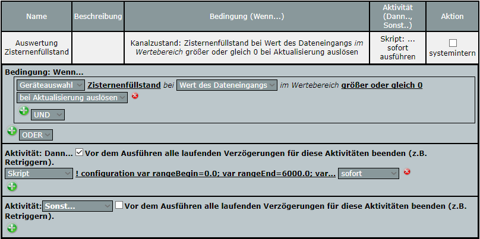

# HomeMatic Ultraschall-Füllstandsmessung

Mit wenigen Modulen kann eine Ultraschall-Füllstandsmessung für das [Hausautomationssystem HomeMatic](http://www.homematic.com/) realisiert werden.

## Details
 
* Eine aufwändige Messwertvorverarbeitung sorgt für einen stabilen Messwert mit einer hohen Genauigkeit.
* Durch die fast vollständige Ausnutzung der 8 Bit des Sendemoduls ergibt sich eine maximale Abweichung von 0,2%. Bei einer 6000l Zisterne bedeutet das eine maximale Abweichung von nur 12l.
* Ein spezieller Fehlerwert (255) kennzeichnet eine fehlerhafte Messung oder einen defekten Sensor.

## Bauteileliste

* Arduino Nano V3
* HomeMatic 8-bit Sendemodul (HM-MOD-EM-8Bit)
* Ultraschall-Modul mit wasserdichtem Sensor (z.B. JSN-SR04T)
* USB-Netzteil inkl. Mini-USB-Kabel

## Verschaltung der Module

Anschluss Ultraschall-Modul:

|JSN-SR04T|Arduino Nano|
|:---:|:---:|
|5V|5V|
|Trig|A0|
|Echo|A1|
|GND|GND|

Anschluss HomeMatic-Sendemodul:

|HM-MOD-EM-8Bit|Arduino Nano|
|:---:|:---:|
|3,5-12V|5V|
|GND|GND|
|IN1|8 (PB0)|
|IN2|9 (PB1)|
|IN3|10 (PB2)|
|IN4|11 (PB3)|
|IN5|12 (PB4)|
|IN6|5 (PD5)|
|IN7|6 (PD6)|
|IN8|7 (PD7)|

Prototypischer Aufbau:


## Programmierung Arduino Nano

Der [Sketch LevelSensor.ino](LevelSensor/LevelSensor.ino) ist entsprechend des Anwendungsfalls zu konfgurieren und auf den Arduino Nano zu laden.

Um nur das HomeMatic-Sendemodul zu testen, kann der [Sketch TransmitterTest.ino](TransmitterTest/TransmitterTest.ino) verwendet werden.

## Projektierung CCU

### Konfiguration Sendemodul

Der Kanal 3 vom Sendemodul muss wie folgt eingestellt werden:


#### Hinweis 

Der Satz "Der Dateneingang ist deaktivert, wenn der Datenübertragungspin (DU30) auf HIGH-Pegel ist (low aktiv)." trifft nicht zu. In diesem Anwendungsfall ist DU30 auf HIGH-Pegel und das Modul sendet bei Änderung der Dateneingänge trotzdem. Im Benutzerhandbuch ist das Sendeverhalten für Mode 4 richtig beschrieben: "Datenübertragungseingang HIGH -> Auswertung EIN".

### Systemvariable

Anzulegende Systemvariable:


### Programm

In der CCU ist folgendes Programm für die Messwertauswertung zu erstellen:



Folgendes Skript ist im Dann-Zweig einzutragen. Die Konfiguration ist entsprechend dem Anwendungsfall anzupassen:

```
! configuration
var rangeBegin=0.0;
var rangeEnd=6000.0;
var precision=0;
var errorValue=-100.0;
var sysVarName="Zisternenfüllstand";

! read device data point and update system variable
var sv=dom.GetObject(ID_SYSTEM_VARIABLES).Get(sysVarName); 
var src=dom.GetObject("$src$");
if (sv && src) {
    var val=src.State();
    if (val==255) {
      sv.State(errorValue);
    } else {
      val=(((rangeEnd-rangeBegin)*val)/254.0)+rangeBegin;
      sv.State(val.Round(precision));
    }
}
```
